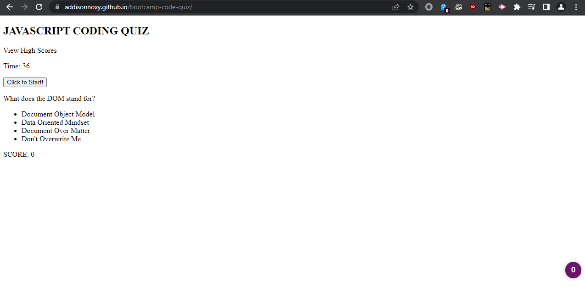

# bootcamp-code-quiz

## Description
This webpage was designed as an example quiz for JavaScript terminology and practice. It features very limited questions, but does allow you to track your score and store it in local storage for later display.

[Link to the project repository.](https://github.com/AddisonNoxy/bootcamp-code-quiz)

## Installation
N/A

## Usage
Click on the start button to begin the quiz. Correct answers add to your score, incorrect answers reduce your remaining time. Final score is calculated based on correctly answered questions and time remaining.

After the quiz, a score can be submitted by entering a name and pressing submit. Recorded scores can be viewed with the "View High Scores" button.

## Credits
N/A

## License
Please refer to the LICENSE in the repo.